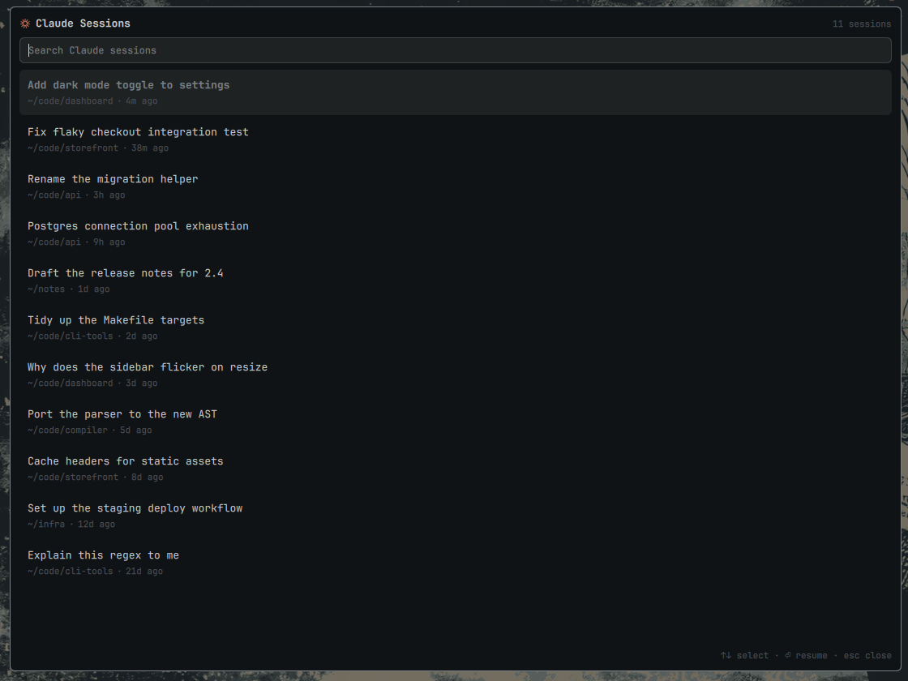

# Omarchy Claude Sessions

Browse every past [Claude Code](https://claude.com/claude-code) session across all your projects and resume one in a terminal, from an Omarchy panel.



Claude's own `claude --resume` picker only lists sessions belonging to the directory it starts in. This panel gathers sessions from every project, shows the folder each one belongs to, and resumes by session id — so continuing yesterday's work in another repo is one keystroke instead of a `cd` followed by a second pick.

## Features

- Every session from every project, most recent first
- Readable titles — uses the `ai-title` Claude generates per session, falling back to the first message you typed
- Type to filter across titles, your original message, and folder paths
- `↑`/`↓` to select, `Enter` to resume, `Esc` to close
- Themed with the active Omarchy theme

## Install

```bash
omarchy plugin add https://github.com/diegodiaz1256/omarchy-claude-sessions --enable
```

`omarchy plugin add` validates the manifest before installing anything, which
is why it is the only install path documented here.

## Usage

Summon the panel:

```bash
omarchy-shell shell summon diegodiaz1256.claude-sessions
```

### Add it to the Omarchy menu

```bash
~/.config/omarchy/plugins/diegodiaz1256.claude-sessions/bin/add-to-omarchy-menu
```

It then appears under **Super → Claude → Resume Session**, and typing "claude"
in the menu finds it.

A plugin cannot register menu rows itself: the menu reads them from exactly two
files, the packaged default and `~/.config/omarchy/extensions/omarchy-menu.jsonc`,
and the `menu` plugin kind means "supply the whole menu UI" rather than "add rows
to the existing one". `omarchy plugin add` has no post-install hook either, so
this is a script you run rather than something the install does for you. It is
idempotent, keeps the rest of your file untouched, and re-running it after an
update refreshes the rows.

To do it by hand instead, add to that file:

```jsonc
"claude": {"icon":"󰛄","label":"Claude","aliases":["ai","claude-code"]},
"claude.resume": {"icon":"󰑖","label":"Resume Session","aliases":["resume"],"action":"omarchy-shell shell summon diegodiaz1256.claude-sessions","when":"command -v claude"},
```

### Bind it to a key

In `~/.config/hypr/bindings.conf`:

```
bind = SUPER, A, exec, omarchy-shell shell summon diegodiaz1256.claude-sessions
```

Pick a key Omarchy is not already using — `SUPER + C` is copy, for instance.
To see what is taken:

```bash
hyprctl binds -j | jq -r '.[] | select(.modmask == 64) | .key' | sort -u
```

## Uninstall

```bash
omarchy plugin remove diegodiaz1256.claude-sessions
```

If you added the menu rows, delete the three `"claude"` lines from
`~/.config/omarchy/extensions/omarchy-menu.jsonc`; removing the plugin does not
touch that file. The plugin stores nothing else — no state, no cache, and it
never writes to `~/.claude`.

## How it works

`bin/claude-sessions-list` reads the transcripts under `~/.claude/projects/` and emits JSON. Transcripts reach tens of megabytes, so it reads only the head of each file (for the first typed message and the recorded `cwd`) and the tail (for `ai-title`, which Claude appends as a session grows) rather than parsing them whole — about 45 ms for 13 sessions.

Sessions are resumed by id rather than by folder, so the right conversation is restored even when several share a directory.

The project folder comes from the `cwd` recorded inside the session itself. Claude encodes project paths by replacing `/` with `-`, which is lossy — a folder whose own name contains `-` is indistinguishable from a path separator — so the recorded value is preferred and the encoded directory name is only decoded as a fallback.

## Requirements

- Omarchy with `omarchy-shell`
- `claude` on `PATH`
- `python3` (the panel says so plainly if it is missing)

## License

MIT
